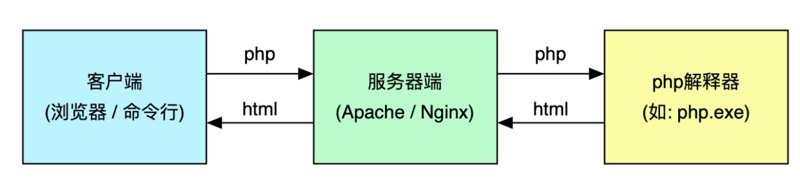

[toc]

## php脚本组成

### 1. ` <?php 和 ?>`标记
PHP 标记为 ` <?php 和 ?>`
```php
//基本语法demo1
<?php
$a = 'Hello';
echo "$a World";
//如果文件内容是纯 PHP 代码，最好在文件末尾删除 PHP 结束标记。
//这可以避免在 PHP 结束标记之后万一意外加入了空格或者换行符，会导致 PHP 开始输出这些空白。

```


在一对开始和结束标记之外的内容都会被 PHP 解析器忽略，我们可以在 HTML 中需要使用 PHP 的地方在执行 PHP 程序

```php
//基本语法demo2
<html>
<head>
    <title>demo</title>
</head>
<body>
<p>
    <?php
    echo 'Hello';
    echo ' World！';
    ?>
</p>
</body>
</html>
```
### 2. ;语句结束符
PHP和c语言一样 需要在每个语句后用分号（;）结束指令。
```php
//;demo
<html>
<head>
    <title>demo</title>
</head>
<body>
<p>
    <?php
    echo 'Hello';
    echo ' World！';
    ?>
</p>
</body>
</html>

```
### 3. 注释符

```php
<?php
//注释demo,//,#,/* */三种都可以 

//这是单行注释
# 也可以使用
/*当然也可以注释*/

```
## php 程序执行流程



执行流程哪下:

1. 客户端请求服务器端的 php 程序
2. 服务器端将 php 程序转发给 php 解释器执行
3. php 解释器执行完毕将生成的 html 或其它内容返回到服务器
4. 服务器将最终生成的 html 代码做为响应内容返回客户端


## php常见的打印方式

| 序号 | 指令           | 描述                                           |
| ---- | -------------- | ---------------------------------------------- |
| 1    | `echo`         | 语言结构, 可查看多个变量                       |
| 2    | `print`        | 语言结构,功能与`echo`类似,区别是有返回值       |
| 3    | `print_r()`    | 函数,以更容易理解的格式打印变量信息,常用于数组 |
| 4    | `var_dump()`   | 函数,可查看一个变量更多信息,如类型             |
| 5    | `var_export()` | 函数,输出或返回一个变量的字符串表示(源代码)    |

> 实际工作中, `echo`和`var_dump()`基本可以满足大多数需求

##  变量

php中的变量标识符必须是以$开头的

### 1. 变量作用域

在php中大体上可以分为下面两类作用域


| 序号 | 作用域     | 描述                             |
| ---- | ---------- | -------------------------------- |
| 1    | 局部作用域 | 使用`function`关键字创建的作用域 |
| 2    | 全局作用域 | 函数之外的变量生效范围           |


在所有函数外部定义的变量，拥有全局作用域。除了函数外，全局变量可以被脚本中的任何部分访问，需要注意的是在其他语言中，全局变量，是在任何位置都可以访问的。而在php中，在函数中访问全局变量，除了php内置的(官方叫超全局变量)之外，不能直接访问。一般有两种方式:

- 在函数内部使用`global`关键字先声明一下
- 使用超全局变量`$GLOBALS`


```php
<?php

// 变量作用域

// 全局作用域
$name = '嘿嘿嘿';
//HP 将所有全局变量存储在一个名为 $GLOBALS[index] 的数组中。 index 保存变量的名称。这个数组可以在函数内部访问，也可以直接用来更新全局变量。
// 超全局变量不受作用域限制
// print_r($GLOBALS['siteName']);

// 声明函数: 同时也创建一个函数作用域
function getInfo()
{
    // 定义了一个函数"私有变量"
    // 1. 方法1: global
    // global $siteName;
    // 2. 使用超全局变量
    $name = $GLOBALS['name'];

    return $name;
}

echo getInfo();


```
---
### 2. 超全局变量

其实就是系统内置的全局变量而已，随系统加载,因此在所有脚本中均有定义,全局和函数中都可以访问，下面是php中内置的全局变量列表

| 序号 | 变量名      | 描述                                                    |
| ---- | ----------- | ------------------------------------------------------- |
| 1    | `$GLOBALS`  | 所有的全局变量都是保存在这个内置变量中的                         |
| 2    | `$_SERVER`  | 服务器和执行环境信息                                    |
| 3    | `$_GET`     | HTTP GET 请求:通过 URL 参数传递给当前脚本的变量的数组   |
| 4    | `$_POST`    | HTTP POST 请求: 将变量以关联数组形式传入当前脚本        |
| 5    | `$_FILES`   | HTTP 文件上传变量,保存着上传文件的全部信息              |
| 6    | `$_COOKIE`  | 通过 HTTP Cookies 方式传递给当前脚本的变量的数组        |
| 7    | `$_SESSION` | 当前脚本可用 SESSION 变量的数组                         |
| 8    | `$_REQUEST` | 默认情况下包含了 `$_GET`，`$_POST` 和 `$_COOKIE` 的数组 |
| 9    | `$_ENV`     | 通过环境方式传递给当前脚本的变量的数组                  |

### 3. static变量

在函数内部中定义的变量，在函数完成时，他就会释放，而有时候希望某个局部变量不要被删除。这时候就可以使用static关键字来声明

### 4. 可变变量

在其他语言中变量名一般是不能动态改变的，在php中可以在程序中动态改变变量标识符，变量名也可以是其他变量的值
```php

<?php
//变量名可以是动态的，其他的变量值

$test1 = 'hello';

$$test1 = 'this is var'; //变量名是$test1标识符的内容->$hello

echo $hello;  //this is var

function $$test1
?>
```

##  常量

### 1. 常量的定义与使用

常量的概念，其他语言里面也有，常量不需要使用`$`符号。php中定义常量有两种方式

- `define`函数
- `const` 关键字

两者的区别是

- const不能用在局部，比如函数内和流程控制语块内，而define是可以的。

- const可以作为类成员，define不行


```php
//常量的定义与使用
<?php

// define方式
define("NAME", 'jack');
echo NAME, '</br>';

// const方式
const AGE = 18;
echo AGE, '</br>';

function test()
{
    //函数内部定义的常量，只有执行了这一行，才会定义
    define("GRADE", 98);
}
test(); //调用test函数执行常量定义
echo GRADE; //因为GRADE是在test函数内部定义的，所以在他前面必须调用test函数
?>


```

### 2. 常量的常用函数

| 序号 | 定义方式                  | 描述             |
| ---- | ------------------------- | ---------------- |
| 1    | `get_defined_constants()` | 查看系统所有常量 |
| 2    | `defined()`               | 检测常量是否存在 |
| 3    | `define()`                | 创建常量         |
| 4    | `const` 关键字            | 创建常量         |
| 5    | `constant()`              | 获取常量值       |

- `get_defined_constants(true)`: 常量分组打印,自定义常量在`user`分组
- `defined()`: 返回布尔值

### 3. 预定义常量

预定义常量非常多,有许多与具体扩展相关,如 `PDO`, 这里仅列出系统级常用的:

| 序号 | 预定义常量             | 描述                                      |
| ---- | ---------------------- | ----------------------------------------- |
| 1    | `PHP_VERSION`          | PHP 版本                                  |
| 2    | `PHP_MAXPATHLEN`       | PHP 路径最大长度:1024                     |
| 3    | `PHP_OS_FAMILY`        | 操作系统:Windows/Darwin/Linux             |
| 4    | `PHP_SAPI`             | web 服务器与 php 之间接口: apache2handler |
| 5    | `PHP_EOL`              | 行尾结束符                                |
| 6    | `PHP_INT_MAX`          | 最大整数: `9223372036854775807`           |
| 7    | `PHP_INT_MIN`          | 最小整数: `-9223372036854775808`          |
| 8    | `PHP_INT_SIZE`         | 整数宽度: `8`                             |
| 9    | `PHP_FLOAT_MAX`        | 最大浮点数:`1.7976931348623E+308`         |
| 10   | `PHP_FLOAT_MIN`        | 整小浮点数: `2.2250738585072E-308`        |
| 11   | `DEFAULT_INCLUDE_PATH` | 默认 PHP 命令路径                         |
| 12   | `PHP_EXTENSION_DIR`    | 默认 PHP 扩展路径                         |
| 13   | `E_ERROR`              | 运行时错误: 致命中断                      |
| 14   | `E_PARSE`              | 语法解析错误: 致命中断                    |
| 15   | `E_NOTICE`             | 运行时提示: 不中断                        |
| 16   | `E_WARNING`            | 运行时警告: 不中断                        |
| 17   | `E_ALL`                | 所有级别错误(除`E_STRICT`)                |
| 18   | `E_STRICT`             | 更加严格的错误处理机制,高于`E_ALL`        |
| 19   | `TRUE`                 | 布尔真                                    |
| 20   | `FALSE`                | 布尔假                                    |
| 21   | `NULL`                 | 空                                        |
| 22   | `DIRECTORY_SEPARATOR`  | 目录分隔符                                |

更多预定义常量:<https://www.php.net/manual/zh/reserved.constants.php>


##  运算符

运算符和其他语言差不多，但是有几个比较特殊的，和其他语言不一样


### 1. 字符串拼接

在php中字符串的拼接使用`.`，而在其他语言里面使用`+`

```php
//字符串拼接
<?php

$name = '嘿嘿'.'哈哈';
echo $name;

?>
```

### 2. == 和 ===

==比较两个变量的值，不比较数据类型。

=== 全等，比较两个变量的值和类型

```php
//==和===
<?php
$age = 18;
//==比较两个变量的值，不比较数据类型。会自动进行类型转换
var_dump($age == '18');  //true

//===比较两个变量的值和类型
var_dump($age==='18');   //false

?>
```

### 3. <=>太空船运算符

用于比较两个表达式 $a 和 $b，如果 $a 小于、等于或大于 $b时，它分别返回-1、0或1。
```php
//<=>太空船运算符
<?php

var_dump( 1 <=> 1); //0
var_dump( 1 <=> 2); //-1
var_dump( 2 <=> 1); //1

?>
```

### 4. 三元运算符


| 序号 | 运算符 | 示例       | 描述                      | 场景       |
| ---- | ------ | ---------- | ------------------------- | ---------- |
| 1    | `?:`   | `$a ?: $b` | 仅判断表达式`true/false`  | 简化双分支，和其他用法一样 |
| 2    | `??`   | `$a ?? $b` | 判断变量存在且不为 `null` | 设置默认值 |


```php
//三元运算符
<?php
// ?:
$age = 18;
echo $age > 60?  '年龄大了':  '很年轻'; //'很年轻'
echo '</br>';

//?? null合并运算符
$name = '小c';
$name = $name  ?? '小明'; //如果name存在且不为 `null`
echo $name  //小c
?>
```

### 5. 错误屏蔽符

| 运算符 | 示例      | 描述             | 场景         |
| ------ | --------- | ---------------- | ------------ |
| `@`    | `@(10/0)` | 屏蔽所有运行错误，语法错误屏蔽不了 | 线上生产环境 |

```php
//错误屏蔽符
<?php
error_reporting(E_ALL);  //打开错误的错误提示
echo $name; //这一句会有错误，使用了未定义的变量
echo @$name //@符号可以屏蔽错误

?>
```

## 数据类型

PHP 是弱语言类型，定义变量的时候不需要制定变量类型，根据上下文自动解成对于的变量类型。也就是说，如果把一个 string 值赋给变量 $var，$var 就成了一个 string。如果又把一个 int 赋给 $var，那它就成了一个 integer。


### 1. 数组

php中的数组比较强大，实际上是一个有序映射。映射是一种把 values 关联到 keys 的类型。此类型在很多方面做了优化，因此可以把它当成真正的数组，或列表（向量），散列表（是映射的一种实现），字典，集合，栈，队列以及更多可能性。由于数组元素的值也可以是另一个数组，树形结构和多维数组也是允许的。

定义数组可以用 array() 或 [] 来新建一个数组，它接受任意数量用逗号分隔的键（key） => 值（value）对。

```php
<?php
//定义数组demo
$array = array(
    "foo" => "bar",
    "bar" => "foo",
);

// 自 PHP 5.4 起
$array = [
    "foo" => "bar",
    "bar" => "foo",
];
?>
```

`key` 可以是 `integer`（索引数组）或者 `string`（关联数组），`value`可以是任意类型，如对象、数组。

此外 key 会有如下的强制转换：

- 包含有合法整型值的字符串会被转换为整型。例如键名 "8" 实际会被储存为 8。但是 "08" 则不会强制转换，因为其不是一个合法的十进制数值。
- 浮点数也会被转换为整型，意味着其小数部分会被舍去。例如键名 8.7 实际会被储存为 8。
- 布尔值也会被转换成整型。即键名 true 实际会被储存为 1，而键名 false 会被储存为 0。
- Null 会被转换为空字符串，即键名 null 实际会被储存为 ""。
- 数组和对象不能被用为键名。坚持这么做会导致警告：Illegal offset type。


key 为可选项。如果未指定，PHP 将自动使用之前用过的最大 int 键名加上 1 作为新的键名。


```php
//数组key的demo

<?php
$array = array("foo", "bar", "hallo", "world");
var_dump($array); //array(4) { [0]=> string(3) "foo" [1]=> string(3) "bar" [2]=> string(5) "hallo" [3]=> string(5) "world" }


print "</br>";
$array = array(1=> "foo", "bar", "hallo", "world");
var_dump($array);//array(4) { [1]=> string(3) "foo" [2]=> string(3) "bar" [3]=> string(5) "hallo" [4]=> string(5) "world" }
?>

```

数组单元可以通过 array[key]或者array{key}语法来访问。
```php

//访问数组demo
<?php
$array = array(
    "foo" => "bar",
    42    => 24,
    "test" => array(
        "test_2" => array(
            "array" => "foo"
        )
    )
);

var_dump($array["foo"]);
print '</br>';

var_dump($array[42]);
print '</br>';

var_dump($array["test"]["test_2"]["array"]);
?>
```
>注意:方括号和花括号可以互换使用来访问数组单元（例如 $array[42] 和 $array{42} 在上例中效果相同）。

## 流程控制

php中的流程控制和其他语言没什么大的区别，但是在php中的流程控制语句有对应的模板语法。


## 函数

> php函数支持默认参数，这个和c基本一样，默认参数要在必选参数的后面。


> php函数传参数有传值和引用


### 1. 可变函数(变量函数)

php中支持可变函数的概念（也叫变量函数），可以这样理解，如果一个变量名后有小括号( )，那么 PHP 就会寻找与变量值同名的函数并执行它。也就是说如果给一个变量赋不同的值，程序就会调用不同的函数。

需要注意的是，可变函数不能直接用于例如 echo、print、unset()、isset()、empty()、include、require 以及类似的语言结构，需要使用自己包装的函数来将这些结构用作可变函数。

```php
<?php
//可变函数
function add($a, $b){
    return $a + $b;
}

$add2 = 'add';

print $add2(1, 2)  //3
?>
```

### 2. 匿名函数

PHP 允许临时创建一个没有指定名称的函数。匿名函数通常用在回调函数中，同时匿名函数也可以赋值给一个变量后使用，还能像其他任何 PHP 对象那样传递，不过匿名函数仍然是函数，因此可以调用，并且可以传入参数。

>注意：理论上讲，闭包和匿名函数是不同的概念，不过 PHP 将其视作相同的概念，所以提到闭包时，指的就是匿名函数，反之亦然。

```php
//匿名函数
<?php

$radom = function () {
    return 100;
};
echo $radom();

?>
```

### 3. 可变参数
可变参数的概念和c语言差不多，就是传输参数的数量不固定。

在php中php5.6之前则是在函数体内调用 func_get_args()系列函数获取参数信息，php5.6的新变参语法...$args。

```php
<?php
//方式一: php5.6之前则是在函数体内调用 func_get_args()，获取多参数
function demo1( )
{
    // 参数数量
    // return func_num_args();
    // 根据索引返回指定的调用参数
    // return func_get_arg(2);
    // return func_get_args();
    $total = 0;
     for ($i = 0;$i <func_num_args(); $i++ ) {
         $total +=func_get_arg($i);
     }
     return $total;
}

print  demo1(1, 5, 7, 9, 10);
?>
```

```

```

### 4. 回调函数

用法和c中基本一样


## . 命名空间

命名空间和c++中基本一致


##  过滤器

PHP 过滤器用于验证和过滤来自非安全来源的数据，比如用户的输入。
PHP 过滤器用于验证和过滤来自非安全来源的数据。
验证和过滤用户输入或自定义数据是任何 Web 应用程序的重要组成部分。
设计 PHP 的过滤器扩展的目的是使数据过滤更轻松快捷。

```php
<?php

$age = 68;

//filter_var是过滤单个变量，php中有很多以filter_开头的过滤器
var_dump(filter_var($age, FILTER_VALIDATE_INT,['options'=>['min_range'=>18,'max_range'=>60]]));

?>
```

## 引用

引用和c++中差不多，就是一个其他变量的别名，如果其中任何一个的值改变后，另外一个也会改变

```php
//变量引用示例
<?php
$test1 = 100;

$test2 = &$test1;  //引用变量,$test2只是$test1的一个别名，

echo $test1, '---', $test2, '</br>'; // 100---100

$test2 = 200;

echo $test1, '---', $test2, '</br>'; //200---200

$test1 = 999;

echo $test1, '---', $test2, '</br>'; // 999---999

?>
```

## “和'字符串的区别

'符号的字符串中的内容总被认为是普通字符，转义字符"\"在单引号中只能转义自身和单引号自己。


"符号的字符串可以解析里面的变量,以及转义字符

```php
<?php

//单引号
$str = 'php哈哈';

//不能转义\r\n
print 'This \'s a \r\n  $str \\'; //This 's a \r\n $str \
print '</br>';


//双引号


$str = 'test';

//双引号解析变量
echo "this is a $str ing", '</br>';  //this is a test ing
echo "this is a $string", '</br>';  //这种方式是错误的，因为没有$string变量，如果想要这么用需要给$str加变量限定符

//下面两种方式都可以，使用了变量限定符{}
echo "This is a {$str}ing", '<br>'; //This is a testing
echo "This is a ${str}ing";        //This is a testing


?>
```

## 文件包含 
PHP 中 4 种包含语句
- include
- include_once
- require
- require_once

include 和 require 都可以加载文件，不同点在于如果加载的文件包含错误，include 发出警告，继续执行后面的语句，而 require 则发出致命错误，终止程序执行。
不带once后缀的和有带后缀的区别是是否进行重复检测。include_once会保证文件只被包含一次。


查找文件顺序是:
1. 参数是绝对路径（以 / 开头的路径），则直接包含该文件
2. 参数是相对路径或文件名，按照 include_path （可以通过 phpinfo() 查看当前包含的路径）指定的目录寻找。
3. 如果在 include_path 下没找到该文件则在调用脚本文件所在的目录和当前工作目录下寻找。
4. 如果最后仍未找到文件则 include 结构会发出一条警告；这一点和 require 不同，后者会发出一个致命错误。


包含文件的代码也可以写在局部(函数内部)，那包含来的代码也是属于局部(函数内部)。

##  面向对象

自 PHP 5 起完全重写了对象模型以得到更佳性能和更多特性。这是自 PHP 4 以来的最大变化。
PHP 5 具有完整的对象模型。 PHP 5 中的新特性包括访问控制，抽象类和 final 类与方法，附加的魔术方法，接口，对象复制和类型约束。 
PHP 对待对象的方式与引用和句柄相同，即每个变量都持有对象的引用，而不是整个对象的拷贝。参见对象和引用。

### 1. 类的声明

类的声明使用class关键字来完成，基本和c++/java差不多


```php
<?php

//类使用 class 关键字后加上类名定义。
//类名后的一对大括号{}内可以定义变量和方法。
class Student
{
    /*类的成员使用限控制关键字(public,protect,privete)来声明，在php5之前变量可以使用var来声明，相当于php5之后的public*/
    //函数定义类似 PHP 函数的定义，但函数只能通过该类及其实例化的对象访问。函数如果没有权限控制关键字，默认是public
    //->是成员访问符

    /* 成员变量 */
    public $name;

    /* 成员函数 */
    function setName($name)
    {
        //变量 $this 代表自身的对象
        $this->name = $name;
    }

    function getName()
    {
        return $this->name;
    }

}

$jack = new Student;
$sam = new Student;

$jack->setName('jack');   //->是成员访问符
$sam->setName('sam');

echo $jack->getName();
echo '</br>';
echo $sam->getName();

?>
```

### 2. 构造析构


php中的构造和析构 和c++中基本一致，只不过换了一个名字__construct和__destruct

```php
<?php

class Student
{
    /* 成员变量 */
    public $name;

    /*构造析构*/
    function __construct() {
        print "构造函数";
        echo "</br>";
    }

    function __destruct() {
        print "销毁 " . $this->name;
        echo '</br>';
    }
}

$jack = new Student;
$sam = new Student;

?>
```

### 3. 成员权限访问控制

PHP 对属性或方法的访问控制，是通过在前面添加关键字 public（公有），protected（受保护）或 private（私有）来实现的。

- public（公有）：公有的类成员可以在任何地方被访问。
- protected（受保护）：受保护的类成员则可以被其自身以及其子类和父类访问。
- private（私有）：私有的类成员则只能被其定义所在的类访问。

### 4. 继承

php中不支持多继承
php中继承使用extends关键字实现继承 

```php
class Child extends Parent {
   // 代码部分
   //方法重写

}
``


